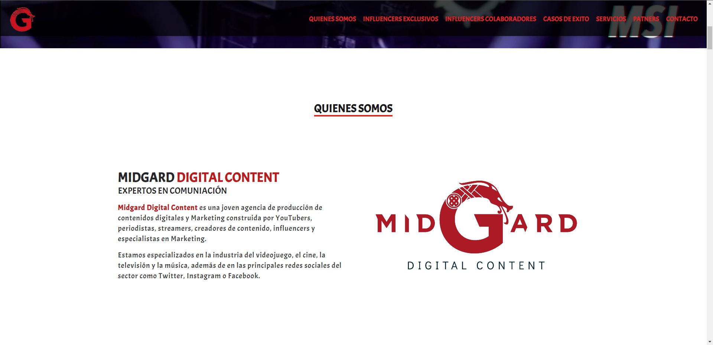

    

---

    

## 🖥️ Despliegue

Porque no entras y miras con quienes han trabajado [Netlify solo tienes que dar clic aqui](https://midgard-digital.netlify.app/)

## 🚀 Instalación

1. Clona este proyecto.
2. Ve a la carpeta del proyecto
   `midgard`
3. Instala las dependencias
   `npm install`
4. Corre en local
   `ng serve`
